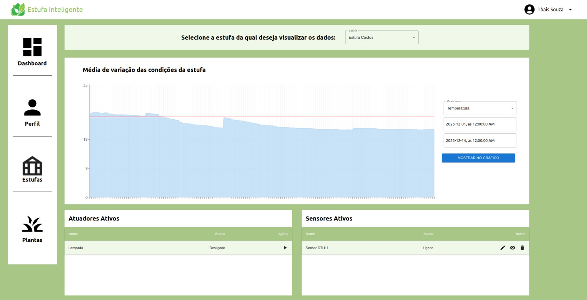

<div align="center">


</div>

# Estufa Inteligente
> Projeto implementado pelos alunos da UNIFEI, em 2023-2, como requisito parcial para aprovação nas disciplinas: COM212, COM222, COM241 e COM242.

[![NPM Version][npm-image]][npm-url]
[![Build Status][travis-image]][travis-url]
[![Downloads Stats][npm-downloads]][npm-url]

Este projeto consiste em uma plataforma para o monitoramento e controle de estufas de flores ornamentais. Direcionado a floricultores e administradores de estufas, ela permite que este usuário monitore os fatores ambientais de suas estufas (temperatura, umidade, etc) de forma remota e automática, bem como atuar sobre algum fator (ligar um irrigador, uma lâmpada, abrir uma cortina, etc) de modo que possa controlar esses fatores garantindo a integridade de suas flores, também de forma remota.

## Componentes do Sistema

### Frontend

Uma aplicação Web que tem o papel de interagir com o usuário, mostrando informações e fornecendo meios e atuar sobre os fatores ambientais da estufa.




Por ela, o usuário tem vários recursos para monitorar e controlar sua estufa. São eles:

* Visualizar os dados de temperatura ou umidade da estufa ao longo do tempo por meio de um gráfico, selecionando o intervalo de tempo desejado, por meio de um formulário;
* Consultar as últimas medições de temperatura e umidade da estufa;
* Controlar um ou mais atuadores da estufa por meio de botões;
* Verificar o estado atual dos sensores e atuadores da estufa;
* Cadastrar estufas e dispositivos (atuadores e sensores);

Tecnologias, frameworks e bibliotecas:

* ReactJS: construção da aplicação;
* React Router Dom: roteamento da aplicação;
* Axios: requisições HTTP;
* TailwindCSS: estilização da aplicação;

### Backend

Um servidor que tem o papel de intermediar as requisições do frontend com o banco de dados, bem como realizar a comunicação com o sistema embarcado que monitora e controla os fatores ambientais da estufa.

O repositório do projeto, na pasta backend, existe uma pasta chamada docs, que contém uma documentação simples das rotas da API. Elas permitem que o frontend faça operações de CRUD sobre os dados de estufas, dispositivos, leituras, endereços, bem como os dados de usuários e autenticação.

As rotas são protegidas por autenticação JWT, de modo que o usuário só pode acessar as rotas se estiver autenticado.

A aplicação também se comunica com o sistema embarcado, por meio de um broker MQTT. O sistema embarcado publica as medições de temperatura e umidade da estufa, bem como o estado dos atuadores, e o servidor se inscreve nesses tópicos para receber essas informações. Além disso, o servidor publica mensagens no tópico de atuação, para que o sistema embarcado possa atuar sobre os atuadores da estufa.

Tecnologias, frameworks e bibliotecas:

* NodeJS: construção do servidor;
* Express: roteamento das requisições;
* Prisma: ORM para o banco de dados;
* PostgreSQL: banco de dados;
* JWT: autenticação de usuários e autorização de requisições;
* MQTT: comunicação com o sistema embarcado;


## Instalação

Para instalar o projeto, é necessário ter o NodeJS e o npm instalados em sua máquina. Depois, basta clonar o repositório.

```sh
git clone
cd estufa-inteligente
```

## Configuração para Desenvolvimento

O procedimento de configuração para desenvolvimento é o mesmo para o frontend e para o backend. Primeiro, é necessário instalar as dependências do projeto.

```sh
npm install
```

Depois, é necessário criar um arquivo .env na raiz do projeto, com as seguintes variáveis de ambiente:

```sh
DATABASE_URL: URL de conexão com o banco de dados
PORT: porta em que o servidor irá rodar
MQTT_HOST: host do broker MQTT
MQTT_PORT: porta do broker MQTT
MQTT_USERNAME: usuário do broker MQTT
MQTT_PASSWORD: senha do broker MQTT
MQTT_CLIENT_ID: id do cliente MQTT
JWT_SECRET: chave secreta para geração de tokens JWT
MQTT_TOPIC_TEMPERATURE: tópico MQTT para temperatura
MQTT_TOPIC_HUMIDITY: tópico MQTT para umidade
MQTT_TOPIC_GREENHOUSE_STATUS: tópico MQTT para status da estufa
MQTT_TOPIC_ACTUATION: tópico MQTT para atuação
```

Por fim, é necessário rodar o servidor.

Para rodar em modo de desenvolvimento:

```sh
npm run dev
```

Para rodar em modo de produção:

```sh
npm run build
npm start
```

## Autores

Alexsander Ventricci [](mailto://alexsander.ventricci@gmail.com) – alexsander.ventricci@gmail.com

Augusto Lázaro Raimundo [](mailto://augusto.lr06@gmail.com) – augusto.lr06@gmail.com

Distribuído sob a licença ISC. Veja `LICENSE` para mais informações.

## Contribuição

1. Faça o _fork_ do projeto (<https://github.com/Ventricci/EstufaInteligente/fork>)
2. Crie uma _branch_ para sua modificação (`git checkout -b feature/fooBar`)
3. Faça o _commit_ (`git commit -am 'Add some fooBar'`)
4. _Push_ (`git push origin feature/fooBar`)
5. Crie um novo _Pull Request_

<!-- Markdown link & img dfn's -->
[npm-image]: https://img.shields.io/npm/v/datadog-metrics.svg?style=flat-square
[npm-url]: https://npmjs.org/package/datadog-metrics
[npm-downloads]: https://img.shields.io/npm/dm/datadog-metrics.svg?style=flat-square
[travis-image]: https://img.shields.io/travis/dbader/node-datadog-metrics/master.svg?style=flat-square
[travis-url]: https://travis-ci.org/dbader/node-datadog-metrics
[wiki]: https://github.com/yourname/yourproject/wiki
